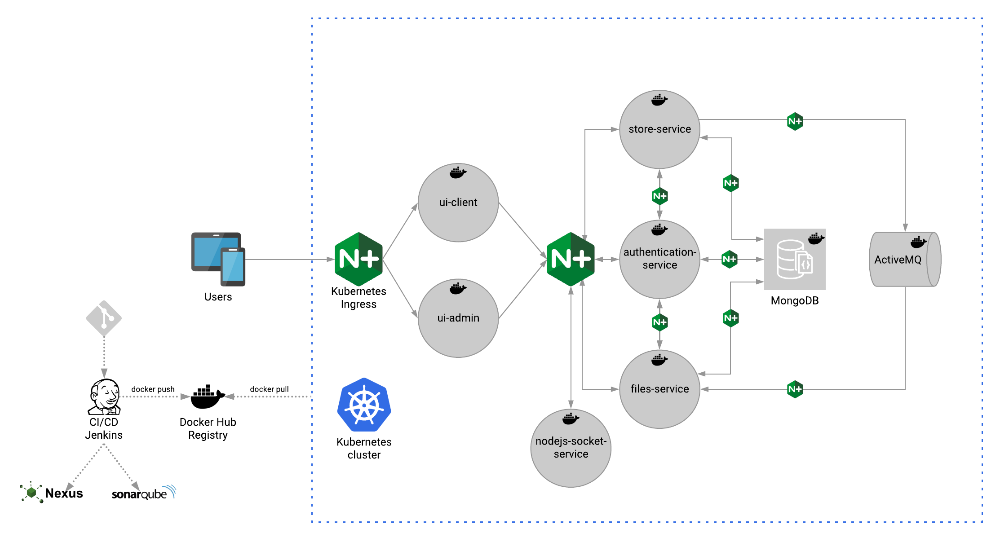

# k8s-eshop
> POC e-shop application, which demonstrates Microservice Architecture Pattern in Kubernetes 



## Table of contents
* [Setup](#setup)
* [Technologies](#technologies)
* [Kubernetes info](#kubernetes-info)
* [Links to k8s-eshop apps](#links-to-k8s-eshop-apps)
* [Running apps locally](#running-apps-locally)
* [microk8s troubleshooting](#microk8s-troubleshooting)

## Setup
- Install virtual box
- Install vagrant
- Clone project
    - `git clone https://github.com/giopeto/k8s-eshop.git`
- Navigate to vagrant-env folder
	- `cd k8s-eshop/vagrant-env`
- Run vagrant provisioning
	- `vagrant up`
- Add `192.168.50.4 service.k8s-eshop.io` to hosts(/etc/hosts or C:\Windows\System32\drivers\etc\hosts)
- Go to virtual machine. Vagrant user:password => vagrant:vagrant
    - `vagrant ssh`
- Run bootstrap.sh
	- `cd k8s-eshop/scripts && sh bootstrap.sh`
- Chmod persistent-volumes-k8s for nexus k8s volume
    - `sudo chmod -R 777 /home/vagrant/persistent-volumes-k8s`

## Technologies
* Kubernetes, MicroK8s, Docker, Vagrant, VirtualBox, ActiveMQ, Jenkins, Nexus, SonarQube, Spring Boot Admin, Jaeger, Maven, Nginx, npm
* Java 8, Spring Boot 2, JUnit, Mockito
* JavaScript ES6, Node.js, Express, TypeScript, Angular 8, Socket.IO
* Bootstrap 4, HTML, CSS
* MongoDB

## Kubernetes info

### Services

| Service | Port | NodePort | Type |
| ------- | ---- | -------- | ---- |
| authentication-service-svc | 8080 | 30101 | LoadBalancer |
| store-service-svc | 8081 | 30102 | LoadBalancer |
| files-service-svc | 8082 | 30103 | LoadBalancer |
| basket-service-svc | 8084 | 30105 | LoadBalancer |
| payment-service-svc | 8085 | 30106 | LoadBalancer |
| nodejs-socket-service-svc | 3000 | 30107 | LoadBalancer |
| ui-admin-svc | 80 | 30100 | LoadBalancer |
| ui-client-svc | 80 | 30104 | LoadBalancer |
| admin-service | 8083 | 30303 | LoadBalancer |
| nexus-svc | 80 | 30181 | LoadBalancer |
| sonar-svc | 80 | 31625 | LoadBalancer |
| jenkins-svc | 80 | 30123 | LoadBalancer |
| mongodb | 27017 | | ClusterIP |
| sonar-postgres | 5432 | | ClusterIP |
| jenkins-jnlp-svc | 50000 | | ClusterIP |

### Ingress
| Service | DNS |
| ------- | ---- |
| authentication-service-svc | k8s-eshop.io/api/authentication-svc |
| store-service-svc | k8s-eshop.io/api/store-svc |
| files-service-svc | k8s-eshop.io/api/files-svc |
| nodejs-socket-service-svc | k8s-eshop.io/api/nodejs-socket-svc |
| ui-client-svc | k8s-eshop.io/client |
| ui-admin-svc | k8s-eshop.io/admin |
| nexus-svc | nexus-svc.k8s-eshop.io |
| jenkins-svc | jenkins.k8s-eshop.io |
| sonar-svc | sonar.k8s-eshop.io |
| sonar-svc | sonar.k8s-eshop.io |
| admin-service | spring-boot-admin-server.k8s-eshop.io |

## Links to k8s-eshop apps

- ### k8s-eshop admin application 
  - Host [http://localhost](http://localhost)
  - Guest [http://admin.k8s-eshop.io](http://admin.k8s-eshop.io)
- ### k8s-eshop client application
  - Host [http://localhost:4008](http://localhost:4008)
  - Guest [http://k8s-eshop.io](http://k8s-eshop.io)
- ### Jaeger tracing
  - Host [http://localhost:4004](http://localhost:4004)
  - Guest [http://jaeger.k8s-eshop.io](http://jaeger.k8s-eshop.io)
- ### Jenkins CI/CD 
  - Host [http://localhost:4001](http://localhost:4001)
  - Guest [http://jenkins.k8s-eshop.io](http://jenkins.k8s-eshop.io)
- ### SonarQube Code Quality and Security user:pass admin:admin
  - Host [http://localhost:4010/sonar](http://localhost:4010/sonar)
  - Guest [http://sonar.k8s-eshop.io/sonar](http://sonar.k8s-eshop.io/sonar)
- ### Nexus repository user:pass admin:admin123
  - Host [http://localhost:4003](http://localhost:4003)
  - Guest [http://nexus.k8s-eshop.io](http://nexus.k8s-eshop.io)
- ### Spring Boot Admin user:pass admin:admin
  - Host [http://localhost:4009](http://localhost:4009)
  - Guest [http://spring-boot-admin-server.k8s-eshop.io](http://spring-boot-admin-server.k8s-eshop.io)
- ### Grafana 
  - run `k cluster-info` and get grafana url

## Running apps locally

### Backend apps
Get k8s activemq-svc and mongodb services CLUSTER-IP

```
vagrant@e-shop-microk8s-ubuntu ~ $ k  get svc activemq-svc mongodb
NAME           TYPE           CLUSTER-IP        ... ...   
activemq-svc   LoadBalancer   10.152.183.84     ... ...
mongodb        ClusterIP      10.152.183.37     ... ...
```

Change application-local.properties
```
spring.data.mongodb.host=[CLUSTER-IP-MONGO] 
# spring.data.mongodb.host=10.152.183.37
...
spring.activemq.broker-url=tcp://[CLUSTER-IP-ACTIVEMQ]:61616 
# spring.activemq.broker-url=tcp://10.152.183.84:61616 !!! Keep the port 61616 here
```

### Frontend apps

Add appropriate key in proxy.conf.json. Existing key "/api/*" need to be last, otherwise newly added key can't be fired

Authentication service key:

```
  "/api/authentication-svc/*": {
    "target": "http://localhost:8080",
    "secure": false,
    "logLevel": "debug",
    "pathRewrite": {
      "^/api/authentication-svc": "http://localhost:8080"
    }
  }
```

Store service key:

```
  "/api/store-svc/*": {
    "target": "http://localhost:8081",
    "secure": false,
    "logLevel": "debug",
    "pathRewrite": {
      "^/api/store-svc": "http://localhost:8081"
    }
  }
```
3.3 Files service key:
```
  "/api/files-svc/*": {
    "target": "http://localhost:8082",
    "secure": false,
    "logLevel": "debug",
    "pathRewrite": {
      "^/api/files-svc": "http://localhost:8082"
    }
  }
```


### Build docker images
  - Build with script
    - `sudo sh /home/vagrant/k8s-eshop/scripts/docker-scripts/script.sh [APP_VERSION] [APP_PATH] [SKIP_NEXUS_HOST](optional default to no)`
      - Example: 
        `sudo sh /home/vagrant/k8s-eshop/scripts/docker-scripts/script.sh 1 store-service` will build store-service app and tagged with 1. If you want to skip adding nexus host to docker image pass `y` as third paramether
      - For java apps first build and deploy to nexus core-dependencies project
        - `cd core-dependencies && mvn clean install && mvn deploy`
  - Build manually
    - Get nexus server ip address(For java apps, oherwise remove --add-host from build command)
	    - `k get svc nexus-svc -o jsonpath='{.spec.clusterIP}'`
    - Build image
	    - `sudo docker build --add-host=nexus.k8s-eshop.io:<NEXUS-SERVER-IP-ADDRESS> .`

###  Get grafana default password
	- cat /var/snap/microk8s/current/credentials/basic_auth.csv
	
	MGJBOFh...,admin,admin,"system:masters"

	user is admin pass is first string(MGJBOFh...)
###  Remote debug

Add debug port to service definition:
  ```
  ports:
    - name: store-service-web
      protocol: "TCP"
      port: 8081
      targetPort: 8081
      nodePort: 30102
    - name: store-service-debug
      protocol: "TCP"
      port: 5005
      targetPort: 5005
      nodePort: 30110   
   ```

- Change entrypoint in Dockerfile(add "-agentlib:jdwp=transport=dt_socket,address=5005,server=y,suspend=n"):
	- `ENTRYPOINT ["java","-agentlib:jdwp=transport=dt_socket,address=5005,server=y,suspend=n","-jar","/usr/app/app.jar"]`
	
- forward 5005 port
	- `k port-forward <NODE_NAME>  5005:5005`

## microk8s troubleshooting

- check node
  - `k get nodes`
- if status is not started run
  - `microk8s.start`
